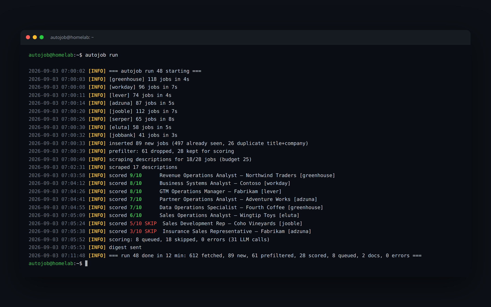
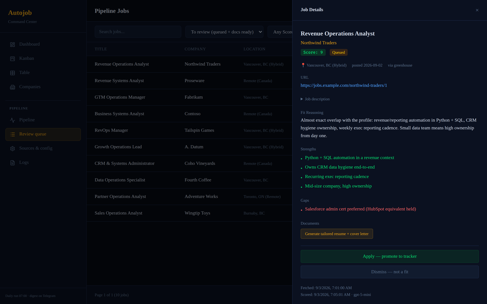
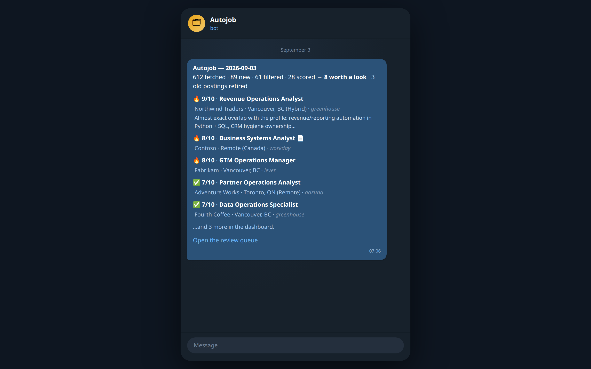
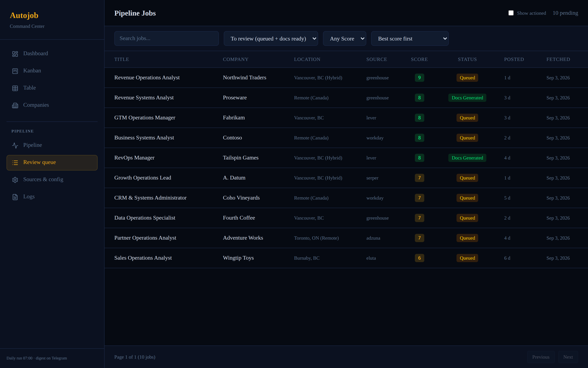
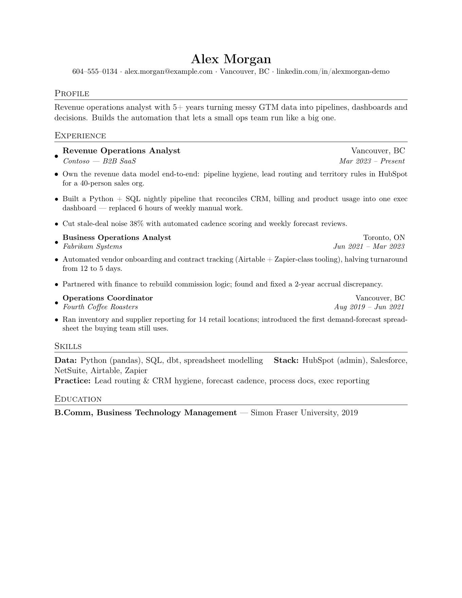
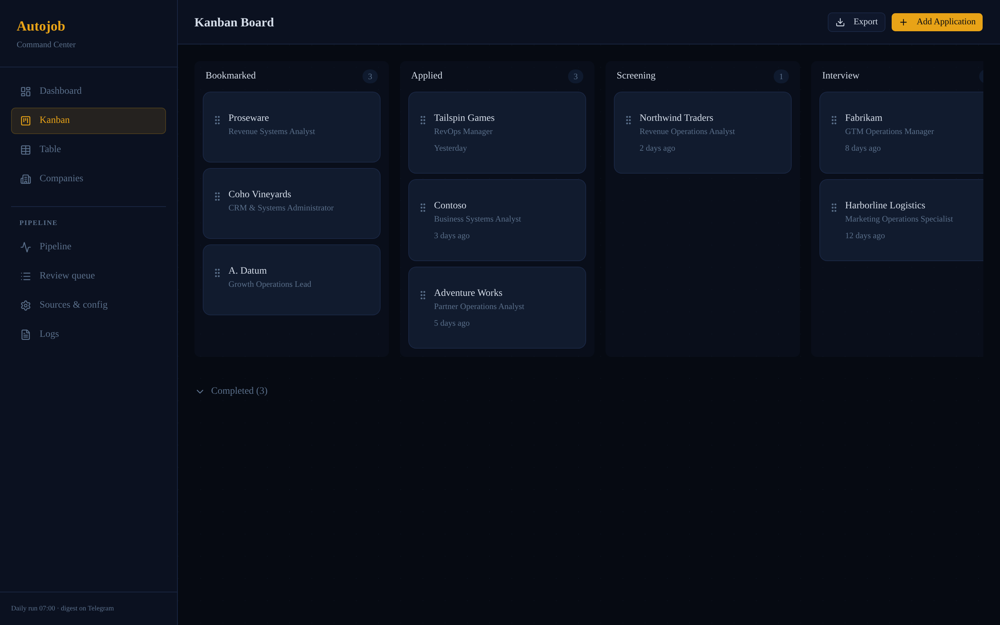

# Shortlist

An automated job-search pipeline with a self-hosted review dashboard.

Every morning at 07:00 the pipeline pulls postings from ~15 sources (job boards, Greenhouse/Workday/Lever feeds, scraper-backed boards), deduplicates them against everything it has ever seen, scores each posting 1–10 against my candidate profile, and sends a single Telegram digest. I review the shortlist in the dashboard, and only for the roles I actually want does it generate a tailored resume + cover letter — then track the application through to response.

**Why "Shortlist"?** Fifteen sources in, one ranked shortlist out — the whole product is the list you actually review.

## The pipeline in action

| **① Found** — 15 sources → dedupe → prefilter | **② Matched** — scored 1–10 against the profile |
|---|---|
|  |  |
| **③ Digest** — one Telegram message per run | **④ Review** — apply / dismiss in the dashboard |
|  |  |
| **⑤ Docs** — tailored resume + cover letter | **⑥ Track** — applications through to offers |
|  |  |

*All screenshots use generic demo data — fictional companies (Northwind Traders, Contoso, Fabrikam…), a demo database and a placeholder candidate.*

## How it works

```
 sources ──► dedupe ──► prefilter ──► score ──► digest ──► review ──► tailored docs ──► tracker
 (15 APIs)   (URL +     (titles,     (LLM,     (Telegram)  (queue)    (resume.tex +     (statuses,
  & feeds)    fingerprint) location,   fallback              actions    cover_letter.tex) reminders)
                         age)          chain)
```

| Stage | What happens |
|---|---|
| **Fetch** | 15 sources: Greenhouse/Workday/Lever ATS feeds, Adzuna, Jooble, Serper, Eluta, company boards. Rate-limited, retried, 5-day catch-up windows. |
| **Dedupe** | Canonical URL + title/company fingerprint. Every posting ever seen lives in SQLite — nothing is re-scored. |
| **Prefilter** | Hard rules first: ~90 title stop-words, employment type, posting age, strict locations. Contracts never reach the model. |
| **Score** | 1–10 against my profile, model fallback chain with cooldowns (one provider being down never kills a run). Budget-capped. |
| **Digest** | One Telegram message per run: everything scored, shortlist on top. |
| **Review** | Dashboard queue: Apply / Dismiss / expiry. The host worker executes doc generation and status changes sent from the UI. |
| **Docs** | LaTeX resume + cover letter, tailored by reordering grounded, pre-written bullets — the model never writes LaTeX from scratch. |
| **Track** | Application states (applied, interview, offer, rejected) + stale-application nudges every 14 days. |

## Repo layout

```
pipeline/    Python package + CLI (fetch, score, docs, worker, doctor)
  config/    sources, queries, prefilter rules, model chain (YAML)
  prompts/   scoring, resume, cover-letter prompts
  systemd/   user units for the daily timer + dashboard worker
dashboard/   Next.js app: review queue, tracker, doc viewer, log tails
```

## Running it

**Pipeline** (Python 3.12):

```bash
cd pipeline
python3 -m venv venv && venv/bin/pip install -e .
cp .env.example .env            # fill in API keys (Gemini/OpenRouter, Serper, Adzuna, Jooble, Telegram)
cp -r profile.example profile   # your candidate profile + LaTeX templates (git-ignored)
venv/bin/autojob doctor         # config + dependency check
venv/bin/autojob run            # full pass: fetch → score → digest
```

Daily timer + dashboard worker: copy `pipeline/systemd/*.service` and `autojob.timer` to `~/.config/systemd/user/`, then `systemctl --user enable --now autojob.timer autojob-worker.service`.

**Dashboard** (Node 20+):

```bash
cd dashboard
npm install
cp .env.example .env
docker compose up -d            # serves on :3100, mounts ../pipeline for the shared SQLite DB
```

The two halves share one SQLite file (`pipeline/data/autojob.db`) through a bind mount: the dashboard writes decisions and commands, a host-side worker (`autojob worker`) executes them — so the container never needs API keys.

## Design notes

- **SQLite everywhere.** One file for jobs/runs/commands, one for the tracker. No server, WAL mode, 10 s busy timeout. Backups are `cp`.
- **Prefilter before LLM.** Hard rules reject ~80% of postings for free; the model only sees plausible fits. A daily run stays well under a cent of API spend.
- **The model never writes LaTeX.** Tailoring reorders and grounds pre-written bullets against the job description — no hallucinated experience, no broken compiles.
- **Fallback chain with cooldowns.** Scoring degrades to the next provider instead of failing the run; a 503 storm trips a cooldown, not a crash.
- **Nothing personal in git.** `profile/`, `.env`, databases and generated PDFs are all git-ignored; `profile.example/` shows the shape.

## Status

In daily use since September 2026. 15 sources, ~2k postings/month processed, review queue kept under ~60 active roles.

*Built and operated by [saunalserver](https://github.com/saunalserver).*
